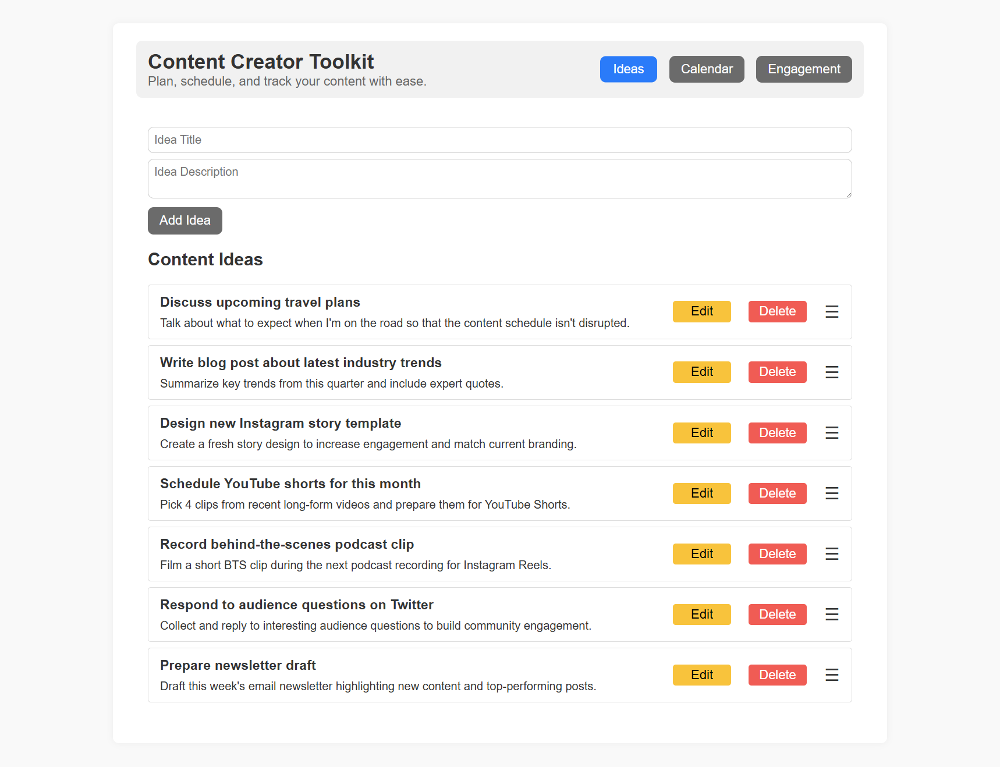
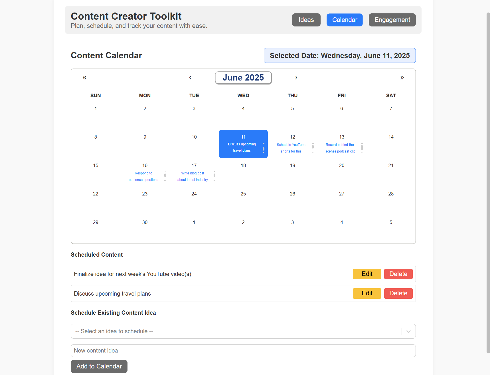
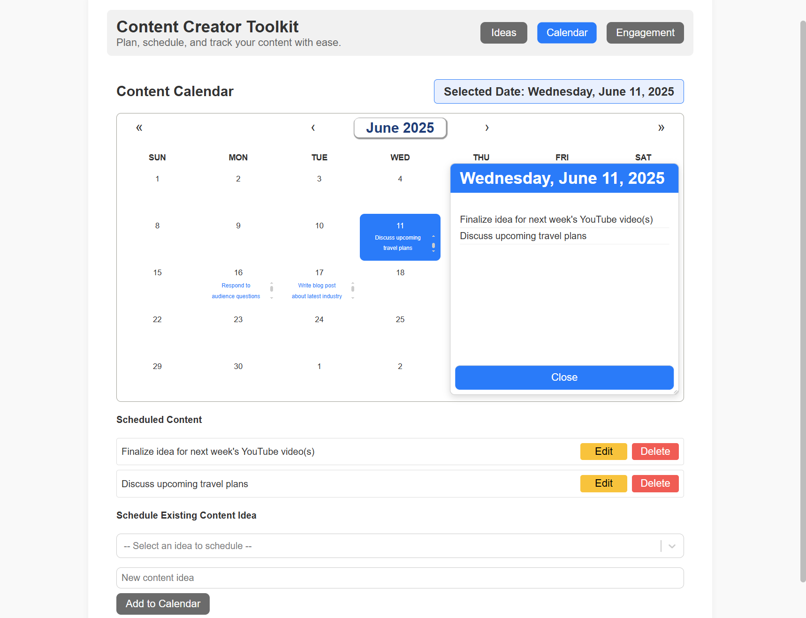
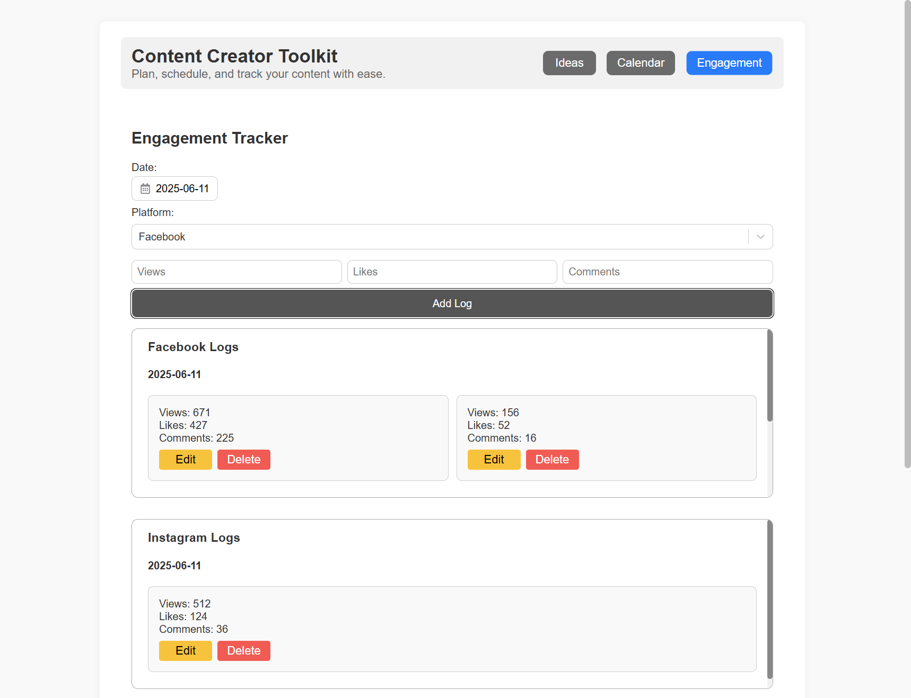

# Content Creator Toolkit Dashboard

A React + Vite application that helps content creators plan, schedule, and track their content across multiple platforms.

[Live Demo](https://content-creator-toolkit.netlify.app)

---

## Features

**Content Ideas Management**  
Add, edit, delete, and prioritize your content ideas.

**Calendar Scheduling**  
Drag and drop content ideas onto the calendar, schedule posts visually, view scheduled content at a glance.

**Engagement Tracker**  
Log and track engagement stats (views, likes, comments) across multiple platforms (YouTube, Instagram, Facebook, Twitter, TikTok, etc).

**Responsive Design**  
Mobile-friendly, clean UI with consistent design patterns.

**Persistent Data**  
LocalStorage support for content ideas, calendar events, and engagement logs.

---

## Screenshots









---

## Tech Stack

- React
- Vite
- react-calendar
- react-datepicker
- react-select
- react-rnd
- react-icons
- CSS

---

## How to Run Locally

1. Clone this repository:

```bash
git clone https://github.com/smithrw1986/content-creator-toolkit.git
cd content-creator-toolkit
```

2. Install dependencies:

```bash
npm install
```

3. Run the development server:

```bash
npm run dev
```

4. Build for production:

```bash
npm run build
```

---

## Author

Ryan Smith: [smithrw1986 on GitHub](https://github.com/smithrw1986)

---

## License

This project is licensed for personal and portfolio use.
